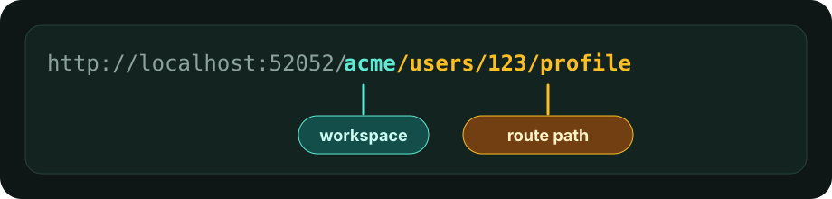

# MockDock

<p align="center">
  
</p>

<p align="center">
  <strong>Local-first API mocking for developers, QA engineers, and teams that need controllable test traffic.</strong>
</p>

<p align="center">
  Capture requests, discover routes, inspect payloads, and switch mock responses without rebuilding the service that depends on them.
</p>

---

## What is MockDock?

MockDock is a self-hosted API mock server with a web dashboard. Run it locally, point an app or service at it, and MockDock will capture incoming traffic, group requests into routes, and let you edit the responses that are returned next.

It is built for fast backend/frontend integration, QA scenarios, mobile app testing, third-party API simulation, and local development environments where real upstream services are slow, unstable, expensive, or unavailable.

## Why MockDock Exists

MockDock aims to be a practical open source mock API workbench:

- Make API mocking easy to start: send traffic first, configure later.
- Keep everything local-first and transparent.
- Help teams reproduce edge cases with response presets, delays, status codes, and payload variants.
- Provide a dashboard that feels useful during real development, not just demo flows.

## Features

- **Request capture:** Record incoming method, path, query, headers, body, IP, returned status, and returned payload.
- **Automatic workspaces:** Use the first path segment as the workspace, for example `/demo/users/42` creates or uses `demo`.
- **Route inference:** Group similar paths like `/users/14` and `/users/99` under parameterized patterns.
- **Live dashboard:** Browse workspaces, routes, request history, response presets, and route details from the UI.
- **Editable response presets:** Save multiple responses per route or variant and switch the active preset.
- **Static mock responses:** Return the selected preset as-is; MockDock does not generate dynamic responses from route parameters, request body values, or custom scripts.
- **Payload modes:** Return JSON, text, XML, raw text, URL-encoded data, form-data-style entries, or binary payloads.
- **Latency simulation:** Add per-preset response delays with `delayMs`.
- **Status and header control:** Customize HTTP status codes and response headers per preset.
- **Query variants:** Return different responses for saved or captured query-string combinations.
- **Wildcard routes:** Manually model broader route rules with single-segment and trailing wildcards.
- **Real-time updates:** Keep the dashboard synchronized through Server-Sent Events.
- **Local persistence:** Store state in SQLite under `data/mockdock.sqlite` by default.
- **Multilingual UI:** English, Portuguese (Brazil), Spanish, Chinese (Simplified), and Hindi.

## Quickstart

### Docker Compose With Docker Hub Images

Use the published Docker Hub images:

```bash
DOCKER_IMAGE_PREFIX=hllink/mockdock MOCKDOCK_VERSION=latest docker compose pull server web
DOCKER_IMAGE_PREFIX=hllink/mockdock MOCKDOCK_VERSION=latest docker compose up --no-build
```

Open the dashboard:

```text
http://localhost:52000
```

Send a request to the mock server:

```bash
curl -i http://localhost:52052/demo/api/v1/users/42
```

MockDock will create the `demo` workspace, infer the route, capture the request, and return the active response preset.

Go back to the dashboard, select the `demo` workspace and captured route, then edit the response preset. Send the same `curl` request again to receive the updated mock response.

To pin a specific release, replace `latest` with the version tag:

```bash
export MOCKDOCK_VERSION=0.1.0
DOCKER_IMAGE_PREFIX=hllink/mockdock docker compose pull server web
DOCKER_IMAGE_PREFIX=hllink/mockdock docker compose up --no-build
```

### Docker Run With Docker Hub Images

Run the latest all-in-one image:

```bash
docker run --rm \
  -p 52000:80 \
  -p 52052:52052 \
  -v "$(pwd)/data:/app/data" \
  hllink/mockdock:latest
```

Then open `http://localhost:52000` and send your first request:

```bash
curl -i http://localhost:52052/demo/api/v1/users/42
```

Or run the server and web UI as separate containers:

```bash
docker network create mockdock

docker run --rm \
  --name mockdock-server \
  --network mockdock \
  -p 52052:52052 \
  -v "$(pwd)/data:/app/data" \
  -e MOCKDOCK_DATABASE_PATH=/app/data/mockdock.sqlite \
  hllink/mockdock-server:latest
```

In another terminal:

```bash
docker run --rm \
  --name mockdock-web \
  --network mockdock \
  -p 52000:80 \
  -e BACKEND_URL=http://mockdock-server:52052 \
  hllink/mockdock-web:latest
```

Set a version tag to pin a release:

```bash
export MOCKDOCK_VERSION=0.1.0
docker run --rm -p 52000:80 -p 52052:52052 -v "$(pwd)/data:/app/data" "hllink/mockdock:${MOCKDOCK_VERSION}"
```

### Docker Compose All-in-One

The Compose file also includes a combined service that runs the web UI and server in one container.

Use the published Docker Hub image:

```bash
DOCKER_IMAGE_PREFIX=hllink/mockdock MOCKDOCK_VERSION=latest docker compose --profile all-in-one pull mockdock
DOCKER_IMAGE_PREFIX=hllink/mockdock MOCKDOCK_VERSION=latest docker compose --profile all-in-one up --no-build mockdock
```

Or build it locally:

```bash
docker compose --profile all-in-one up --build mockdock
```

Ports are the same:

- Dashboard: `http://localhost:52000`
- Mock server: `http://localhost:52052`

The `52000` and `52052` ports are a small nod to the 52-hertz whale, the inspiration behind MockDock's whale identity.

State is stored in `./data/mockdock.sqlite`.

### Build Images Locally

Build the server and web containers from this repository:

```bash
docker compose up --build
```

Or build all local images with the helper script:

```bash
./scripts/docker-build.sh
```

That creates these local image tags:

- `mockdock-server:latest`
- `mockdock-web:latest`
- `mockdock:latest`

You can pass a version tag:

```bash
./scripts/docker-build.sh 0.1.0
```

## Standalone Development

MockDock uses Node.js 22 and pnpm workspaces. This repository expects `nvm` for Node.js commands.

```bash
nvm use 22
pnpm install
pnpm dev
```

Or use the helper script:

```bash
./start-dev.sh
```

The development servers run on:

- Web dashboard: `http://localhost:52000`
- Mock server/API: `http://localhost:52052`

The `52` in both default ports references the 52-hertz whale.

## How MockDock Reads URLs

MockDock currently uses the first path segment as the workspace.



The request above is stored as:

- Workspace: `acme`
- Normalized route path: `/users/123/profile`
- Inferred route pattern: `/users/{id}/profile`

## Example Workflow

1. Start MockDock.
2. Point your app, mobile client, test suite, or local service to `http://localhost:52052`.
3. Send traffic using a workspace prefix, for example `/demo/...`.
4. Open `http://localhost:52000`.
5. Select the captured route.
6. Inspect request headers, body, query, and response.
7. Edit the active response preset.
8. Send the same request again and receive the new mocked response.

## API Reference

MockDock reserves the `/__mockdock` path for dashboard and management APIs. All other paths are treated as mock traffic.

Responses are static presets. MockDock can switch presets per route or query variant, but it does not compute response values dynamically from path parameters, request bodies, headers, or scripts.

### Mock Traffic

| Method | Path | Description |
| --- | --- | --- |
| `GET` `POST` `PUT` `PATCH` `DELETE` `OPTIONS` `HEAD` | `/<workspace>/<route>` | Captures the request, creates or updates the inferred route, and returns the active mock response. |

Example:

```bash
curl -i http://localhost:52052/demo/api/v1/users/42
```

### Management API

| Method | Path | Description |
| --- | --- | --- |
| `GET` | `/__mockdock/health` | Health check with database and version status. |
| `GET` | `/__mockdock/version` | Returns the MockDock version. |
| `GET` | `/__mockdock/workspaces` | Lists workspaces. |
| `POST` | `/__mockdock/workspaces` | Creates a workspace. |
| `PATCH` | `/__mockdock/workspaces/:workspaceId` | Renames a workspace slug. |
| `DELETE` | `/__mockdock/workspaces/:workspaceId` | Deletes a workspace and its data. |
| `GET` | `/__mockdock/workspaces/:workspaceId/routes` | Lists routes for a workspace. |
| `POST` | `/__mockdock/workspaces/:workspaceId/routes` | Creates a manual route. |
| `GET` | `/__mockdock/routes/:routeId/requests` | Lists captured requests for a route. |
| `PUT` | `/__mockdock/routes/:routeId/pattern` | Updates a route pattern. |
| `POST` | `/__mockdock/routes/:routeId/convert-segment` | Converts a route path segment. |
| `POST` | `/__mockdock/routes/:routeId/move` | Moves a route to another workspace. |
| `POST` | `/__mockdock/routes/bulk-delete` | Deletes multiple routes. |
| `DELETE` | `/__mockdock/routes/:routeId` | Deletes a route. |
| `GET` | `/__mockdock/routes/:routeId/variants` | Lists query variants for a route. |
| `POST` | `/__mockdock/routes/:routeId/variants` | Creates a query variant. |
| `PUT` | `/__mockdock/variants/:variantId` | Updates a query variant. |
| `DELETE` | `/__mockdock/variants/:variantId` | Deletes a query variant. |
| `GET` | `/__mockdock/routes/:routeId/presets` | Lists default-variant presets for a route. |
| `POST` | `/__mockdock/routes/:routeId/presets` | Creates a default-variant response preset. |
| `GET` | `/__mockdock/variants/:variantId/presets` | Lists presets for a query variant. |
| `POST` | `/__mockdock/variants/:variantId/presets` | Creates a response preset for a query variant. |
| `PUT` | `/__mockdock/presets/:presetId` | Updates a response preset. |
| `DELETE` | `/__mockdock/presets/:presetId` | Deletes a response preset. |
| `POST` | `/__mockdock/routes/:routeId/active-preset` | Sets the active preset for the default variant. |
| `POST` | `/__mockdock/variants/:variantId/active-preset` | Sets the active preset for a query variant. |
| `GET` | `/__mockdock/events` | Opens the Server-Sent Events stream. |

### Common Examples

Health check:

```bash
curl http://localhost:52052/__mockdock/health
```

List workspaces:

```bash
curl http://localhost:52052/__mockdock/workspaces
```

List routes for a workspace:

```bash
curl http://localhost:52052/__mockdock/workspaces/<workspace-id>/routes
```

Create a response preset:

```bash
curl -X POST http://localhost:52052/__mockdock/routes/<route-id>/presets \
  -H 'content-type: application/json' \
  -d '{
    "name": "Created",
    "statusCode": 201,
    "headers": { "content-type": "application/json" },
    "body": { "kind": "json", "value": { "created": true } },
    "delayMs": 0
  }'
```

Activate a preset:

```bash
curl -X POST http://localhost:52052/__mockdock/routes/<route-id>/active-preset \
  -H 'content-type: application/json' \
  -d '{ "presetId": "<preset-id>" }'
```

## Configuration

The server supports these environment variables:

| Variable | Default | Description |
| --- | --- | --- |
| `MOCKDOCK_HOST` | `0.0.0.0` | Host used by the mock server. |
| `MOCKDOCK_PORT` | `52052` | Port used by the mock server. |
| `MOCKDOCK_DATABASE_PATH` | `data/mockdock.sqlite` | SQLite database path. |
| `MOCKDOCK_BODY_LIMIT_BYTES` | `16777216` | Maximum request body size. |
| `MOCKDOCK_VERSION` | `0.0.1` | Version reported by the internal API. |
| `BACKEND_URL` | service-dependent | Backend URL used by the web container proxy. |

## Repository Layout

```text
apps/server                 Fastify mock server and internal API
apps/web                    Angular dashboard
packages/shared             Shared TypeScript contracts and helpers
packages/route-inference    Workspace and route pattern inference
docker/                     Combined container runtime files
data/                       Local SQLite persistence
```

## Development Commands

```bash
nvm use 22
pnpm build
pnpm test
pnpm lint
pnpm typecheck
```

## Tech Stack

- Angular
- Fastify
- SQLite
- Drizzle ORM
- Server-Sent Events
- TypeScript
- pnpm workspaces
- Docker / Docker Compose

## Project Status

MockDock is early-stage open source software. The current focus is a reliable local mocking workflow: capture traffic, infer routes, inspect requests, and control responses from the dashboard.
